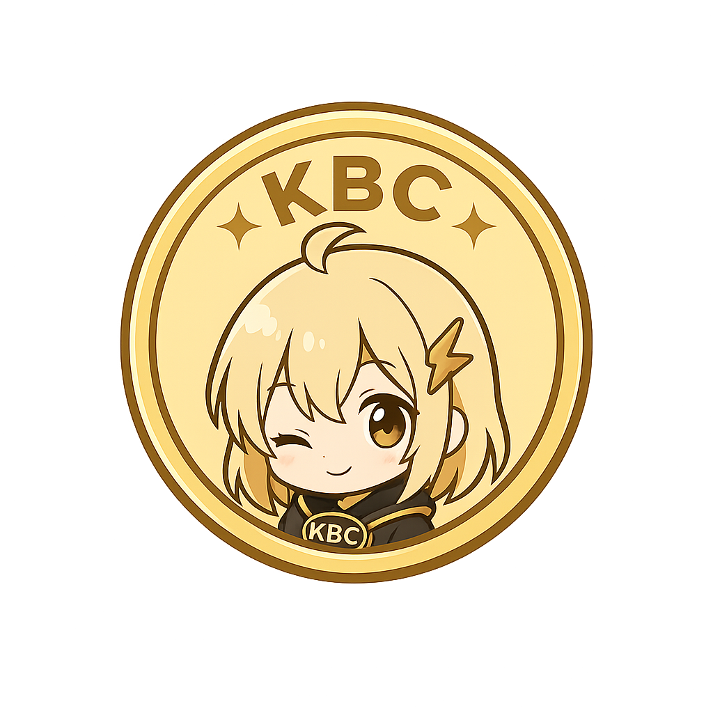

<div align="center">
  
</div>

# Karbitcoin (Mini Cryptocurrency)


A simple yet structured implementation of a cryptocurrency built from scratch using C++.
This project focuses on understanding the fundamentals of blockchain, cryptography, and distributed systems.

---

## 🧠 Overview

This project implements a minimal but proper cryptocurrency system, including:

- Blockchain data structure
- Proof of Work (PoW)
- UTXO-based transaction model
- Digital signature using OpenSSL (ECDSA)
- P2P Networking (TCP-based)
- Automated Unit & Integration Testing

---

## 🏗️ Project Structure

```
karbitcoin/
├── CMakeLists.txt
├── src/                # Implementation files
│   ├── core/           # Blockchain, Block, Transaction, Storage logic
│   ├── crypto/         # Hashing, ECDSA, Wallet, UTXO
│   ├── network/        # P2P Node, Serialization
│   └── main.cpp
├── include/            # Header files
├── tests/              # Test suite (GTest)
│   ├── unit/           # Unit tests for components
│   └── integration/    # Integration tests (flow)
└── build/              # Build directory
```
---

## ⚙️ Features

✅ **Implemented**

- [x] Blockchain with linked blocks
- [x] SHA-256 hashing
- [x] Proof of Work (mining + difficulty)
- [x] UTXO-based transaction model
- [x] ECDSA digital signature (OpenSSL)
- [x] Address generation from public key
- [x] Transaction validation (Signature & UTXO checks)
- [x] Mempool (pending transactions)
- [x] Mining with block rewards & fees
- [x] Full chain validation
- [x] P2P node communication (TCP)
- [x] Transaction & Block propagation
- [x] Chain synchronization (Handshake + Sync)
- [x] **Improved P2P Reliability (Message Queue & Thread Safety)**
- [x] **JSON-based Persistence (Blocks, UTXO, Metadata)**
- [x] **Interactive CLI Wallet (Interactive & Persistent)**
- [x] **Multi-threaded Mining (Configurable thread count)**
- [x] **Automated Testing (30+ cases)**

---

## 🛠️ Build & Run

### Requirements
- **C++17** compiler
- **CMake** (>= 3.16)
- **OpenSSL** (libcrypto)
- **Boost** (Asio, System)
- **nlohmann_json**
- **GTest** (Google Test)

### Build
```bash
cmake -S . -B build
cmake --build build -j$(nproc)
```

### Run Node
You can specify a custom port to run multiple nodes on the same machine. Data will be saved in `data_<port>/`.
```bash
./build/bin/karbitcoin [port]
```
*Default port is 8333 if not specified.*

---

## 💻 Interactive CLI

The application provides a real-time interactive shell to manage your wallet and node.

### Commands
| Command | Description |
|---------|-------------|
| `status` | Show node status, wallet address, balance, and chain height. |
| `balance` | Quick check of your current wallet balance. |
| `mine` | Mine pending transactions into a new block. |
| `send <addr> <amt>` | Send coins to a specific address. |
| `connect <ip> <port>` | Connect your node to a peer. |
| `info` | Show technical details about the blockchain and data directory. |
| `help` | Display all available commands. |
| `exit` | Safely stop the node and exit. |

### Example Usage Scenario
1. **Start Node A (Miner):**
   ```bash
   ./build/bin/karbitcoin 8333
   karbitcoin> mine
   karbitcoin> status # Balance should be 50 KBC
   ```
2. **Start Node B (Receiver):**
   Open another terminal:
   ```bash
   ./build/bin/karbitcoin 8334
   karbitcoin> status # Copy the Wallet Address
   ```
3. **Connect and Send:**
   Back in Node A terminal:
   ```bash
   karbitcoin> connect 127.0.0.1 8334
   karbitcoin> send <address_node_b> 10.5
   karbitcoin> mine
   karbitcoin> status # Balance decreases after send + reward
   ```

---

## 🧪 Testing

We use **Google Test** for verification.

```bash
cd build
ctest --output-on-failure
```

Tests include:
- `test_crypto`: Hash, ECDSA, UTXO, and Wallet logic.
- `test_core`: Transaction, Block, Blockchain integrity, and Persistence.
- `test_integration`: Full mining flow (Transaction -> Mining -> Balance check).

---

## 🧠 Design Philosophy

- Simplicity over completeness
- Readability over optimization
- Incremental learning approach
- **Robust Persistence**: JSON-based storage with auto-recovery support for UTXO sets from block history.
- **Persistent Wallets**: Keys are saved to `wallet.json` in the data directory.

---

## ⚠️ Disclaimer

This project is for educational purposes only.
Do NOT use this implementation in production or for real financial systems.

---

## 📌 Roadmap

- [x] Core blockchain
- [x] Proof of Work
- [x] Transactions & UTXO
- [x] Digital signatures
- [x] Mempool & Validation
- [x] Networking (Basic P2P + Sync)
- [x] Testing Framework (GTest)
- [x] Persistence (Save/Load to disk)
- [x] CLI Wallet interface
- [x] Difficulty adjustment algorithm
- [x] Multi-threaded mining


---

## 🤝 Contribution

Feel free to fork and experiment. This project is designed to be a learning playground.

---

## 📜 License

MIT License
